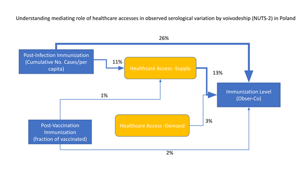

Polska przestrzennie: zakazenia, zgony, seroprewalencja a HCA

```{r setup, include=FALSE}
knitr::opts_chunk$set(echo = TRUE)
library(tidyverse)
library(pheatmap)
library(egg)
load("dostepnosc2.RData")

```
PctExp- wyjaśniana zmienność

Model regresji czynnikowej z interakcjami na poziomie województw (rzutowanie -zmienna wyjaśniani na seroprewalencję >20 lat z pierwszej tury Obser-co) 


```{r }
mod_sero=lm(obser_cov~ case_3rd_wave+case_3rd_wave*HeathCareAccess_per_w+HeathCareAccess_w*case_3rd_wave+case_3rd_wave*HeathCareAccess_per_w*proc_vac_full_w, data=woj_com)

af <- anova(mod_sero)
afss <- af$"Sum Sq"
proc_sero<-cbind(af,PctExp=afss/sum(afss)*100)

proc_sero

```

Dlategi dobrą zmienną pośrednicząca między skumulowaną liczbą zakażeń a wynikami serologicznymi (realizowanymi na wczesnym etapie szczepień populacyjnych) jest dostępność do podażowa służby zdrowia.
```{r}

```

model regresji czynnikowej z interakcjami na poziomie powiatów (rzutowanie - zmienna wyjaśniana na liczbę przypadków w drugiej połowie września) 

Specjalnie wybraliiśmy ostatnie 2 tygodnie września/przełom pażdziernika jako w miarę niezależny od dochodu (już importowane przypadki z wakacji nie powinny wpływać za bardzo a zaraz zaczną się ogniska w ośrodkach akademickich, które zaburzą obraz).

```{r }
mod_zakazenia=lm(inf_autumn~vacc_+ HealthCareAcc*size_COVID+vacc_* HealthCareAcc*size_COVID*HealthAcc_phys, data=vacc_sel_norm)

af <- anova(mod_zakazenia)
afss <- af$"Sum Sq"
proc_zakazenia<-cbind(af,PctExp=afss/sum(afss)*100)
proc_zakazenia
```
Bardzo dobrą zmienną wyjaśniającą zapadalność jest dostępność popytowa do służby zdrowia, która to wyjaśnia zdecydowaną większość zmienności w modelu. Warto podkreślić, że poziom zaszczepienia czy skumulowana liczba zakaźeń na miekszańca w poprzednich falach, nie mają specjalnie znaczenia patrząc na zapadalność w 4-tej fali. 

```{r}
knitr::include_graphics("zak_diag.png", dpi=100)
```


Model regresji czynnikowej z interakcjami na poziomie powiatów (rzutowanie - zmienna wyjaśniana na liczbę zgonów 15.09-21.11) 

```{r }
mod_zgony=lm(deaths_norm~vacc_+ HealthCareAcc*size_COVID+vacc_* HealthCareAcc*size_COVID*HealthAcc_phys, data=vacc_zgony)


af <- anova(mod_zgony)
afss <- af$"Sum Sq"
proc_zgony<-cbind(af,PctExp=afss/sum(afss)*100)
proc_zgony
```
Dobrą zmienną wyjaśniającą umieralność jest dostępność popytowa do służby zdrowia. Poziom zaszczepienia (6%) czy skumulowana liczba zakaźeń na miekszańca w poprzednich falach (2%), mają istotne znaczenie, ale wciąż dostęp popytowy do służby zdrowia jest najważniejszy (12%).

```{r}
knitr::include_graphics("current_deaths.png", dpi=50)
```


#Dodatowe analizy diagnostyczne

```{r }

par(mfrow=c(2,1))


plot(vacc_sel_norm$vacc_*100, vacc_sel_norm$rt, main = "Real time Reproduction rate (04.10.21) vs vaccination coverage by poviats", ylab = "Rt (2-weekly window)", xlab = "% vaccination coverage", pch=16, col="green") 


plot(vacc_sel_norm$vacc_*100, vacc_sel_norm$tests, main = "Test positivity (04.10.21) vs vaccination coverage by poviats", ylab = "% of positive tests (weekly mean)", xlab = "% vaccination coverage", pch=16, col="blue") 

par(mfrow=c(2,1))

plot(vacc_sel_norm$vacc_*100, vacc_sel_norm$inf_autumn, main = "Incidence (04.10.21) vs vaccination coverage by poviats", ylab = "14day cumulative notifications per 1 000 000", xlab = "% vaccination coverage", pch=16, col="red") 

plot(vacc_zgony$vacc_*100, vacc_zgony$deaths_norm, main = "Normalized Covid deaths (15.09-21.11.21) vs vaccination coverage by poviats", ylab = "death rate 4th wave", xlab = "% vaccination coverage", pch=16, col="yellow") 


```
Należy zauważyć, że obecna 4-ta fala w ujęciu powiatowym nie koreluje
ani z poziomem wyszczepienia (wykresy różnych zmiennych opisujących aktualną dynamikę), ani oficjalną notowabą odpornością pochorobową.
Jedynie udział osób zaszczepionych jest związany z umieralnością na COVID w 4-tej fali i ją redukuje. Trzeba jednak pamiętać, że to zależy też od dostępu do ochrony zdrowia, poziomu odporności po przechorowaniu czy innych czynników jak demografia.
```{r}

vacc_zgony2=vacc_zgony[which(vacc_zgony$deaths>0),]

pl_inf<-ggplot(vacc_zgony, aes(HealthCareAcc,inf_autumn, size=vacc_, color=size_COVID)) + theme_bw()+
  geom_point() + xlab("Demand HCA")+ylab("Incidence 4th wave") +geom_text(aes(label=county),hjust=0, vjust=0, color="red", size=2)

pl_death <- ggplot(vacc_zgony2, aes(HealthCareAcc,deaths_norm, size=vacc_, color=size_COVID)) + theme_bw()+
  geom_point() + xlab("Demand HCA")+ylab("death rate 4th wave") +geom_text(aes(label=county),hjust=0, vjust=0, color="red", size=2)

ggarrange(pl_inf, pl_death)

```
Dynamika zakażeń (zapadalność i zgony) zależą w dużej mierze od dostępności popytowej do służby zdrowia, ale w sposób nieliowy

```{r}
mod_zgony2=lm(deaths_norm~vacc_+ I(HealthCareAcc*HealthCareAcc)+ HealthCareAcc*size_COVID+vacc_* HealthCareAcc*size_COVID*HealthAcc_phys, data=vacc_zgony)


af <- anova(mod_zgony2)
afss <- af$"Sum Sq"
proc_zgony2<-cbind(af,PctExp=afss/sum(afss)*100)
proc_zgony2
```
Duże znaczenie ma wyraz kwadratow dostępności popytowej do służby zdrowia

```{r}

```
